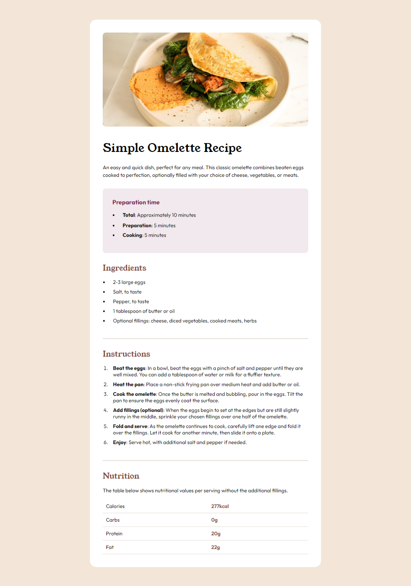
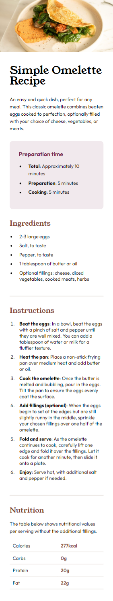

# Frontend Mentor - Recipe page solution

This is a solution to the [Recipe page challenge on Frontend Mentor](https://www.frontendmentor.io/challenges/recipe-page-KiTsR8QQKm). Frontend Mentor challenges help you improve your coding skills by building realistic projects. 

## Table of contents

- [Overview](#overview)
  - [The challenge](#the-challenge)
  - [Screenshot](#screenshot)
  - [Links](#links)

- [Author](#author)

**Note: Delete this note and update the table of contents based on what sections you keep.**

## Overview

### Screenshot

#### Desktop

#### Mobile

### Links

- Solution URL: [GitHub](https://github.com/m-nkosi/RECIPE-PAGE-MAIN.git)
- Live Site URL: [Netlify](https://app.netlify.com/sites/recipe-by-mxolisi/overview)

## My process

### Built with

- Semantic HTML5 markup
- CSS custom properties
- Flexbox
- CSS flex
- Mobile-first workflow

## Author

- Website - [Mxolisi](https://github.com/m-nkosi)
- Frontend Mentor - [@m-nkosi](https://www.frontendmentor.io/profile/m-nkosi)

